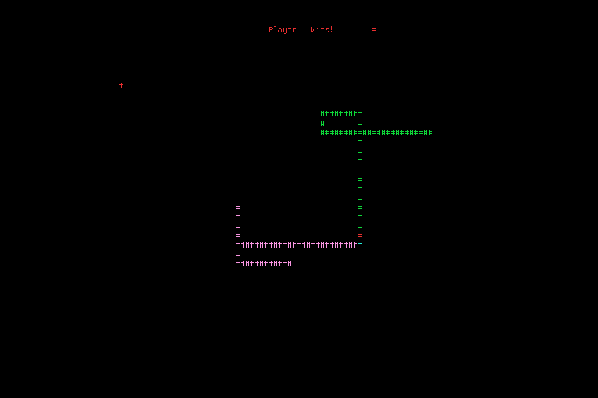

# Snakey
### A multiplayer console snake game.

## Requirements
- [Termbox](https://github.com/nsf/termbox)

## Controls
### Player 1
- `WASD` to move
- `R` to toggle boost
### Player 2
- `IJLK` to move
- `U` to toggle boost

## Additional Notes
- Play online by using tmux and ssh!
- Currently WSL1 is incompatable with Termbox. If you want to use this program through WSL, please upgrade to WSL2.